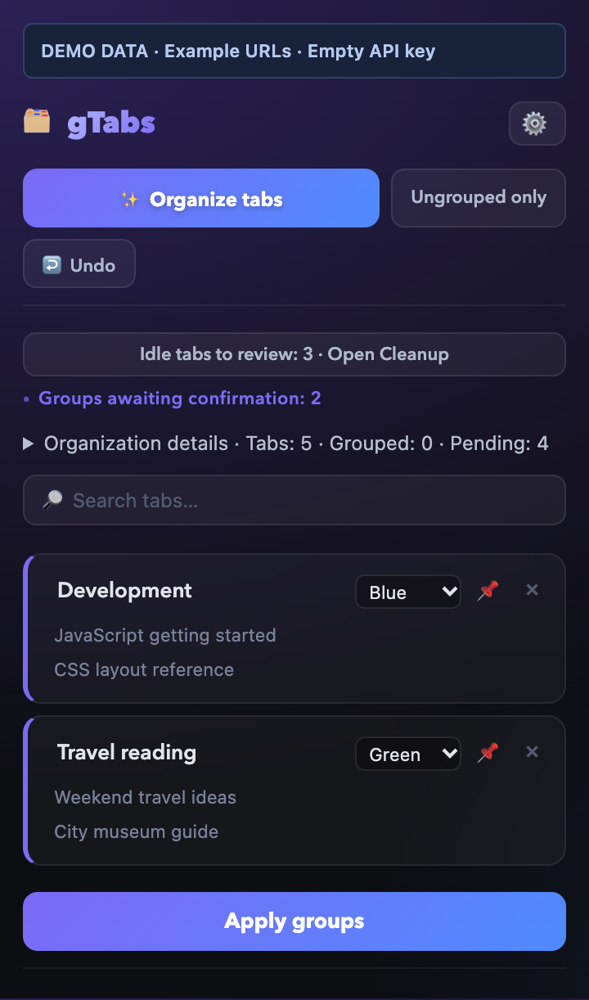
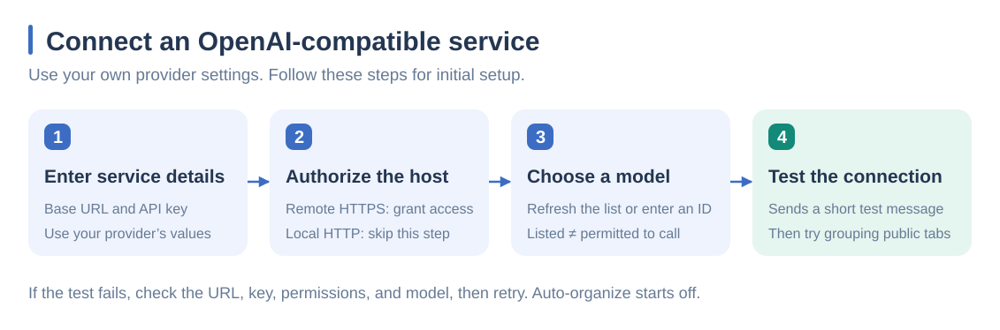
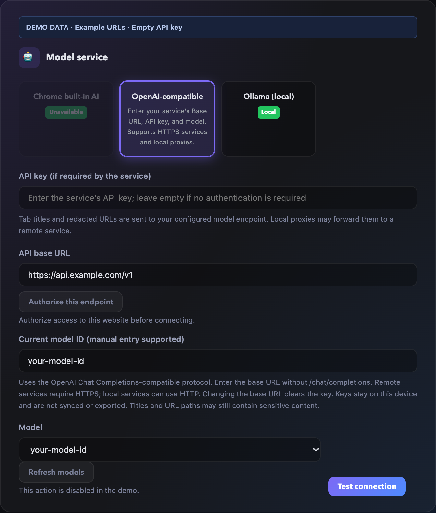
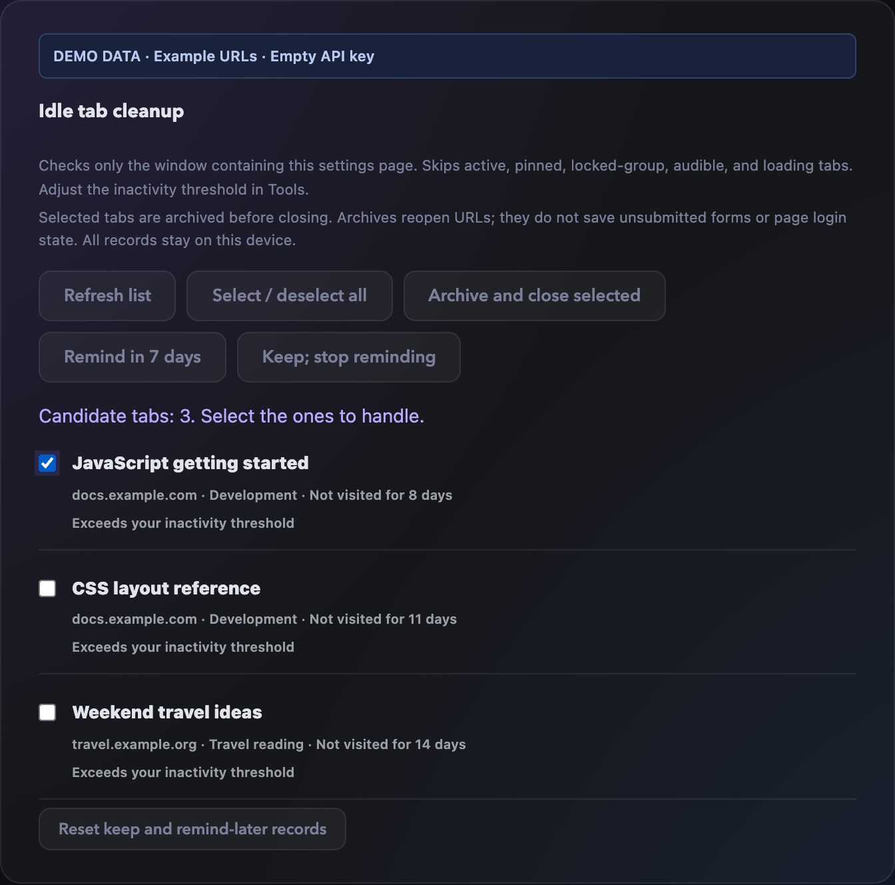

# gTabs

[简体中文](README.md) | English

An independent fork of [vaddisrinivas/gtabs](https://github.com/vaddisrinivas/gtabs) for organizing Chrome tabs with OpenAI-compatible services, local Ollama, or Chrome built-in AI. Version **0.7.0**. This is not the upstream official store release.

## Usage preview

Click **Organize tabs**, review the suggestions, edit group names or colors, then choose **Apply groups**. Here, four fictional tabs are proposed as Development and Travel reading groups. One additional fictional site is excluded; expand the organization report to see why. Suggestions are not applied until you confirm.



All screenshots use the real UI with **synthetic demo data**, reserved example domains, fictional titles and model IDs, and an empty API key. They contain no real browsing records, accounts, or internal addresses. The configuration screenshot does not demonstrate a live connection. Click images to enlarge. See [image sources and reproduction](docs/screenshots/README.md).

## Install

Requires Node.js 22.14+, npm, and Chrome. This repository is private; cloning requires access.

```sh
git clone https://github.com/dengyh/gtabs.git
cd gtabs
npm ci --ignore-scripts
npm run typecheck
npm test
npm run build
```

1. Open `chrome://extensions/` and enable Developer mode.
2. Choose **Load unpacked** and select the project's **dist** directory.
3. Open gTabs settings. Choose **Follow browser**, **简体中文**, or **English** at the top.
4. For an OpenAI-compatible service, enter its Base URL, API key if required, and model ID. Authorize the configured host for remote HTTPS services, refresh models if supported, and test the connection.
5. Review privacy exclusions, organize a test window manually, and apply the preview.

Keep the extension directory in the same location when updating to retain its identity and data. Rebuild, then reload gTabs in Chrome's extension manager.

## Model setup example

In **Settings → Model service**, choose **OpenAI-compatible** and connect your own service:





| Setting | What to enter |
| --- | --- |
| Base URL | Remote example: `https://api.example.com/v1`. Local example: `http://localhost:8000/v1`. Use the actual service address without appending `/chat/completions`. |
| API key | Enter the provider's key. Leave it empty only if the service requires no authentication; the screenshot leaves it empty for privacy. |
| Host permission | Click **Authorize this endpoint** for remote HTTPS. Localhost / 127.0.0.1 HTTP does not need this step. |
| Model ID | Refresh and select from the model list, or enter the exact ID manually. `your-model-id` is only a placeholder. |
| Connection test | After it succeeds, try manual grouping with public pages before enabling automatic organization. |

The example domain is not a working model service. A listed model is not proof of invocation permission, and local proxies may forward requests remotely. See [model setup](MODEL-SETUP.md) for protocol requirements and troubleshooting.

## Languages

The UI supports Simplified Chinese and English. Follow browser uses Simplified Chinese for Chinese browser locales and falls back to English for other languages. A manual selection is saved locally; the settings page reloads after saving. Newly opened popups, background menus, reminders, dates, and new AI group names use that language. Existing group names, rules, workspaces, titles, URLs, and model IDs are preserved.

Extension-manager descriptions and shortcut descriptions follow Chrome's language independently of the in-app selection.

## Organization and cleanup

- Preview groups, edit names or colors, apply, and undo within the original window.
- Automatic organization is off by default. When enabled, normal windows have separate tab thresholds and cooldowns, with checks on tab creation, load completion, and a periodic alarm. Tabs stay in their original windows.
- Domain rules and local learning can route new tabs without a model call. Existing groups can be reused and locked groups are preserved.
- Cleanup lists idle candidates for review. Only selected tabs are archived and closed, with a final protection check. Active, pinned, audible, loading, locked-group, and incognito tabs are protected.
- Archives reopen URLs into the current window and retain group metadata. They do not preserve unsaved forms or page login state. Archives remain until explicitly deleted.

Only one of the three fictional idle candidates below is selected. **Archive and close selected** processes the selection; you can instead remind later or keep tabs. Archived URLs can be reopened from **Archives**.



## Privacy and development

Model requests include eligible tab titles, redacted URLs (domain and path), tab IDs, and relevant existing group names. Local proxies may forward requests remotely. Titles and paths can still contain sensitive data. Private-host and domain exclusions apply before AI requests; public-looking company domains may require manual exclusion.

API keys and settings stay in local extension storage. Keys are not synced or exported, but are not encrypted by the application. Remote services require HTTPS and explicit host permission; HTTP is limited to localhost and 127.0.0.1. Changing the base URL clears the old key. No webpage content, cookies, or browsing-history database is read.

Settings exports (JSON) exclude the API key and cleanup archives, but include the service address, full workspace URLs, titles, groups, rules, and learning records. Rule exports (CSV) contain domains and group names. Markdown copies tab titles, group names, and full URLs to the clipboard. Exports do not apply the exclusions or URL redaction used for model requests: full URLs may contain login parameters or access tokens. Keep backups private and review and redact a copy before sharing or pasting into public repositories, issue reports, or chats. Git ignores common `gtabs-export*.json` and `gtabs-domain-rules*.csv` filenames; renamed files and other formats still need review.

See [model setup](MODEL-SETUP.md), [privacy](PRIVACY.md), [security](SECURITY.md), [development and adding languages](CONTRIBUTING.md), and [changes](CHANGELOG.md). These detailed documents are currently in Chinese.

MIT licensed. Retain [LICENSE](LICENSE) and [NOTICE](NOTICE) when modifying or redistributing. CI checks types, tests, and builds, and uploads the unpacked extension. Publishing source does not publish to the Chrome Web Store.
