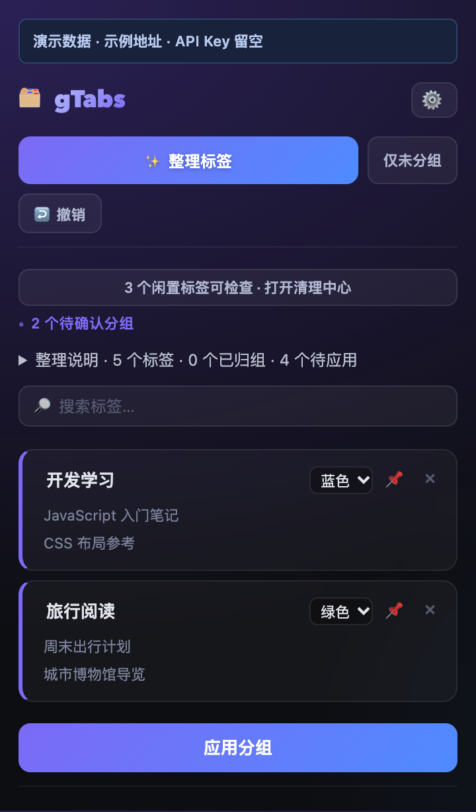
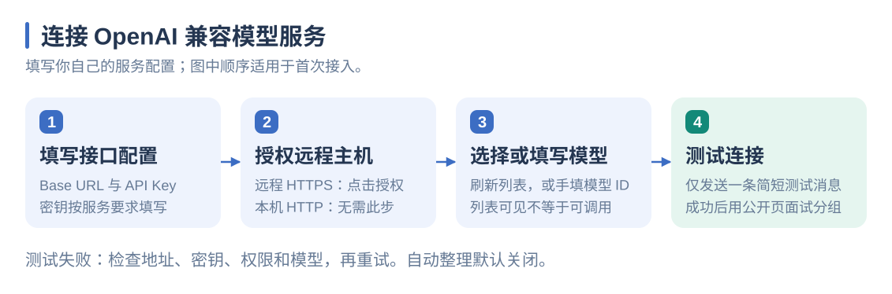
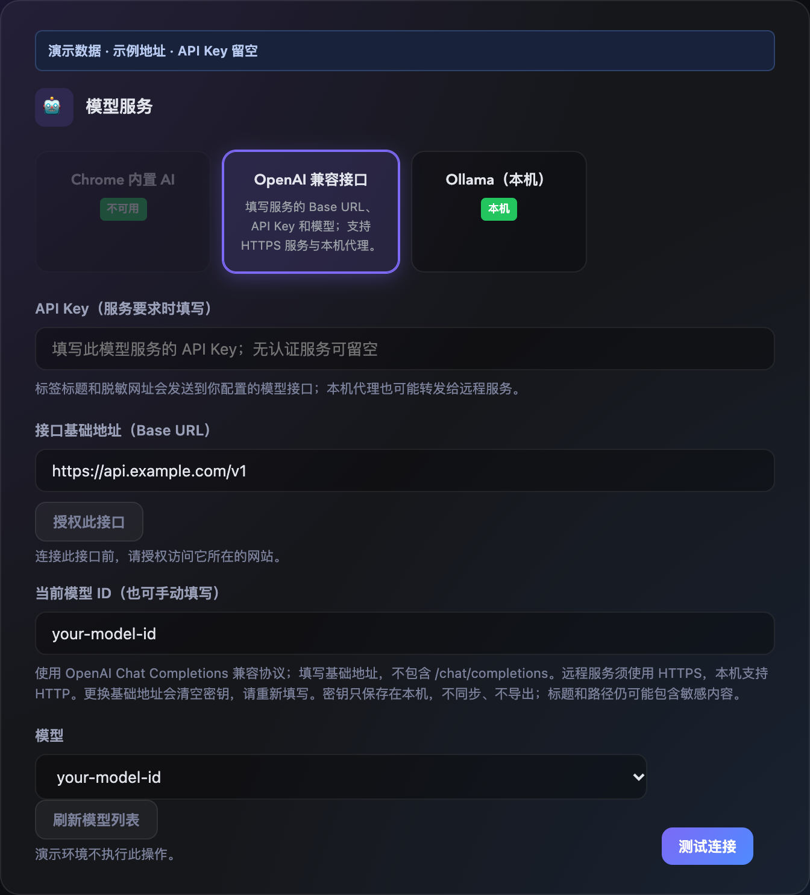
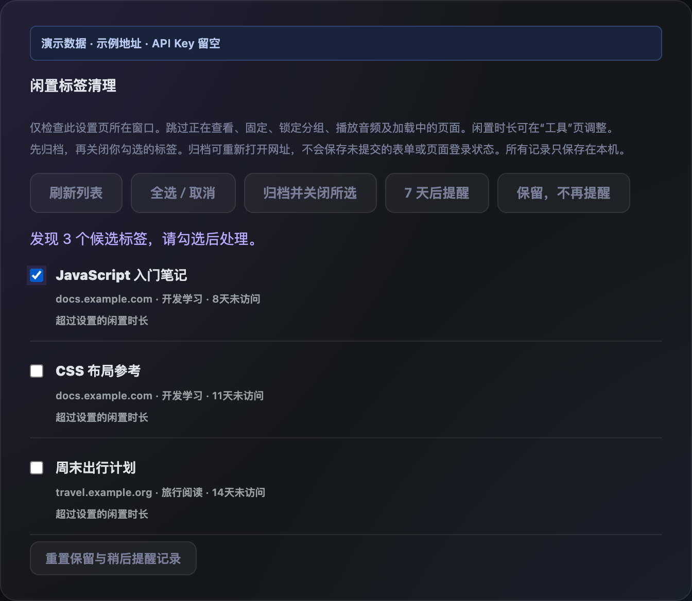

# gTabs

简体中文 | [English](README.en.md)

基于 [vaddisrinivas/gtabs](https://github.com/vaddisrinivas/gtabs) 的独立适配版：通过 OpenAI 兼容接口、本机 Ollama 或 Chrome 内置 AI 整理 Chrome 标签页，提供多语言界面、分组建议、已有分组复用和隐私过滤。当前版本：**0.7.0**。本项目不是上游 gTabs 的官方版本，也不是“GTab 新标签页”。

## 使用示例

点击“整理标签”，先查看建议，再修改分组名称或颜色，最后点击“应用分组”。下图中，4 个虚构标签被建议分为“开发学习”和“旅行阅读”；另一个虚构站点被排除，可展开“整理说明”查看原因。确认前，建议不会应用到标签。



本文所有界面图均由真实界面代码配合**合成演示数据**生成，使用保留的示例域名、虚构标题与模型 ID，API Key 留空。不包含真实浏览记录、账号或内部地址；配置图不表示已连接实际服务。图片可点击放大，[图源和再生成说明](docs/screenshots/README.md)随仓库维护。

## 快速安装

需要 Node.js 22.14+、npm 和 Chrome。选择远程或本机模型服务时，需准备该服务的接口配置。

```sh
git clone https://github.com/dengyh/open-gtabs.git
cd open-gtabs
npm ci --ignore-scripts
npm run typecheck
npm test
npm run build
```

1. 打开 `chrome://extensions/`，启用“开发者模式”。
2. 点击“加载未打包的扩展程序”，选择本项目的 **dist** 目录。
3. 将“gTabs”固定到工具栏，进入设置。顶部可选择“跟随浏览器 / 简体中文 / English”。
4. 按 [模型接口配置说明](MODEL-SETUP.md) 填写 Base URL、API Key 和模型 ID，然后测试连接。
5. 先检查“整理方式 → 隐私与数据发送”，排除工作内网站点。首次建议手动整理，确认预览后点击“应用分组”。

更新代码后重新运行 `npm ci --ignore-scripts` 和 `npm run build`，再在 Chrome 扩展详情中点击“重新加载”。保持 dist 所在目录稳定，移动目录重新加载可能改变扩展 ID 和存储空间。

## 模型配置示意

进入“设置 → 模型服务”，选择 **OpenAI 兼容接口**，按以下顺序接入自己的服务：





| 配置项 | 怎么填写 |
| --- | --- |
| Base URL | 远程示例 `https://api.example.com/v1`；本机示例 `http://localhost:8000/v1`。替换为实际服务地址，不附加 `/chat/completions`。 |
| API Key | 填写服务提供的密钥；只有无需认证的服务才可留空。截图留空是为了避免泄露。 |
| 网站授权 | 远程 HTTPS 服务先点击“授权此接口”；本机 localhost / 127.0.0.1 HTTP 无需此步骤。 |
| 模型 ID | 刷新模型列表后选择，或直接填写准确 ID。图中的 `your-model-id` 是占位符。 |
| 测试连接 | 成功后先用无敏感内容的页面手动试分组，再按需要开启自动整理。 |

示例域名不是可用的模型服务。模型列表可见不代表账号有调用权限；本机代理也可能将请求转发到远程。详细限制与故障排查见 [模型接口配置说明](MODEL-SETUP.md)。

## 语言设置

默认跟随 Chrome 界面语言：中文使用简体中文，其他语言回退到 English。也可在设置顶部手动选择；保存后设置页重新加载，之后打开的弹窗、后台菜单和提醒均使用所选语言。日期格式和新建 AI 分组名称也随之切换。

已有分组、工作区、规则名称、标签标题、网址和模型 ID 不会被翻译或改名。Chrome 扩展管理页的描述与快捷键说明由浏览器语言决定。升级会保留模型配置、规则、归档及分组数据。添加新语言见 [开发指南](CONTRIBUTING.md#多语言)。

## 与上游的区别

| 功能 | 本适配版 |
| --- | --- |
| 界面 | 设置、弹窗、清理、归档、右键菜单、提示和颜色支持简体中文 / English；默认跟随浏览器 |
| 模型连接 | 通用 OpenAI Chat Completions 兼容接口、Ollama 本机服务、Chrome 内置 AI |
| 模型选择 | 从配置接口的 `/models` 读取下拉列表，支持刷新和手动模型 ID；加载失败保留当前选择，调用权限以账号为准 |
| 网络权限 | 本机 HTTP；远程 HTTPS 需用户逐站授权，调用前复核权限；拒绝重定向 |
| 网址脱敏 | 发送前移除账号密码、全部查询参数和片段；保留域名、路径与截断后的标题 |
| 站点排除 | 默认排除内网 IP / 本地主机名，可额外配置域名及子域名 |
| 设置与规则 | 仅存本机；读取旧版时迁移 Chrome 同步配置，成功落盘后删除同步副本 |
| 学习数据 | 保留本地规则与学习归组；历史、修正及域名偏好不再附加到模型请求 |
| 已有分组 | 中文与英文标题匹配；向模型提供符合隐私规则的现有组名，同名建议直接加入对应分组 |
| 开发检查 | 严格 TypeScript 检查、自动化测试、构建、依赖审计；修复上游右键菜单取标签参数的问题 |

## 清理、归档与整理结果

- **清理**：设置页新增“清理”，按当前窗口列出闲置候选、所属分组和未访问天数。默认沿用 48 小时阈值，可在“实用工具”选择 7 / 14 / 30 天或自定义小时数。
- **提醒**：默认每小时在本机检查普通窗口，工具栏提醒标记和悬停文字提示总数量，弹窗提示当前窗口数量。可在“实用工具”关闭；浏览器关闭或休眠期间不保证准点运行。检查不会关闭标签或调用 AI。
- **归档并关闭**：仅处理你勾选的候选。先保存本机归档，失败就不关闭；关闭前重新检查网址、访问时间、窗口、分组和保护状态。跳过当前活动、固定、锁定分组、播放音频、加载中、无痕、内部页面及没有有效访问时间的标签。
- **保留与稍后提醒**：可选择在此窗口保留该网址或 7 天后再提醒；可重置记录。记录按窗口和完整网址匹配，窗口重建后可能重新出现。
- **归档找回**：按标题、网址、分组搜索，单个或整批重新打开到当前窗口；恢复分组名称、颜色和折叠状态，跳过已经打开的相同网址。归档不自动删除。归档接近 8 MiB 或存储失败时停止清理，需手动删除不再需要的记录。归档不包含表单、页面内存或登录状态，不纳入现有设置导出。
- **整理说明**：弹窗展示本次待应用及实际归组数量，并列出隐私排除、分组保护、数量不足、未匹配、状态变化和执行失败等原因。支持直接输入目标组名在本机归组，或进入本地规则设置。结果属于上次操作的快照，撤销后清除。

下图演示“清理”页：3 个虚构候选中只勾选 1 个。点击“归档并关闭所选”后才会处理所选项，也可选择稍后提醒或保留；归档后从“归档”页重新打开。



## 如何触发整理

- **手动整理**：点击扩展按钮或快捷键生成建议，再确认应用。开启“保护并复用已有分组”后只处理未分组标签。
- **自动整理**：默认关闭。开启后，新建标签、标签加载完成和每 2 分钟的后台检查都可能触发。按标签所属窗口分别计数，每个窗口至少间隔 60 秒；达到阈值后排队调用模型并自动应用，冷却期间的新标签会补查。只整理各窗口自己的标签，不跨窗口移动；无痕与非普通窗口不参与自动整理。
- **本地规则快速归组**：与自动 AI 整理分别开关。页面加载后根据来源标签、域名规则和本机学习结果归组，不产生模型请求。
- **定时重新整理**：独立的每天 / 每周功能，默认关闭。Chrome 休眠或关闭时不保证准点执行。

默认模型为 Chrome 内置 AI，默认关闭所有自动整理。使用外部模型时选择“OpenAI 兼容接口”并填写服务地址；建议开启保护已有分组，先用无敏感内容的测试窗口验证。

## 安全与隐私边界

使用 OpenAI 兼容接口时，标签标题、脱敏网址、标签 ID 及用于复用的现有组名会发送到所配置的服务。本机代理也可能转发到远程模型，**本机地址不代表离线推理**。本机 Ollama 与 Chrome 内置模型的联网情况取决于运行环境。

- 不注入网页脚本，不读取网页正文、密码框、Cookie 或浏览历史数据库。`tabs` 权限仍能读取已打开标签的标题与网址。
- 排除规则不解析 DNS；公司使用公网形式的内部域名需要手工加入列表。域名排除覆盖整个子域，不能自动识别所有企业站点。
- 标题与网址路径仍可能包含敏感信息；网址脱敏不能代替站点排除。
- API Token 只保存在 `chrome.storage.local`，没有应用层加密。导出设置不包含 Token 或清理归档，但包含接口地址、工作区完整网址、分组、规则和学习记录。
- CSV 导出包含域名与分组名，Markdown 会把标题、分组名和完整网址复制到剪贴板。导出不套用模型请求的排除和脱敏规则，完整网址可能带登录参数或访问令牌。备份请私下保管，分享前先检查并脱敏；不要直接上传到公开仓库或问题反馈。
- 打开“本地规则快速归组”仍可能在本机移动被 AI 排除的标签，排除规则的含义是“不发送给模型”。
- Chrome 网站授权不按端口或路径隔离；界面只请求所配置主机的权限，运行时只调用当前 Base URL。更换基础地址会清空旧密钥，请重新填写，勿连接不可信服务。

详见 [隐私说明](PRIVACY.md) 与 [安全设计及验证边界](SECURITY.md)。

## 二次开发

**可以二次开发。** 上游为 MIT 许可，允许修改和再分发；保留 [LICENSE](LICENSE) 的版权与许可声明。本仓库保留完整上游 Git 历史，并用 [NOTICE](NOTICE) 标注基线和适配范围。

- [开发指南](CONTRIBUTING.md)：目录、消息流程、如何改模型或分组逻辑、测试、发布、同步上游。
- [更新记录](CHANGELOG.md)
- GitHub Actions 在 main 推送和 PR 时执行类型检查、测试和构建，并提供未打包扩展产物。

本版本沿用原作者的图标和基础界面。自行分发时请明确标识为衍生版本，不要冒充上游官方商店扩展。
